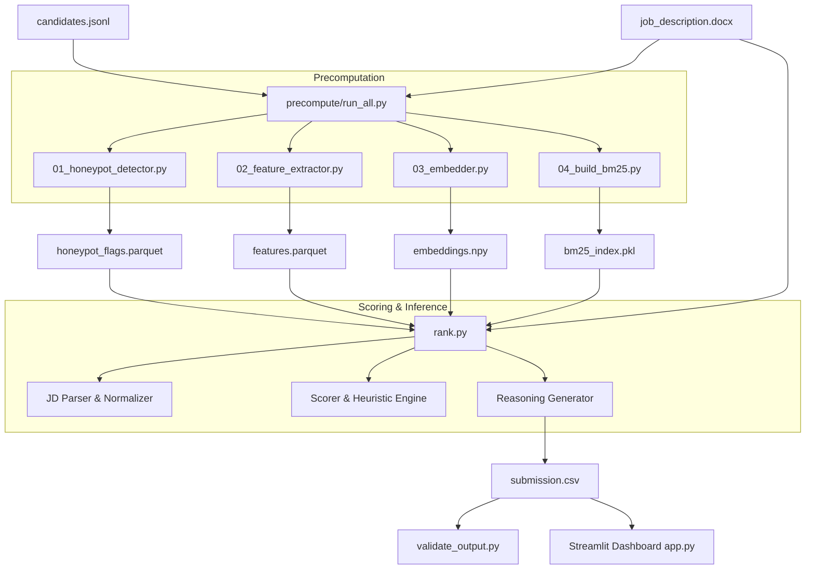

# Offline Candidate Ranker

A production-grade, highly optimized offline pipeline designed to ingest resume candidate profiles (in JSON Lines format), identify malicious or fake ("honeypot") candidates, parse a job description (JD) docx/pdf, extract structured features, compute semantic/TF-IDF alignment scores, and generate an engineered ranking submission.

Includes a Streamlit dashboard sandbox for visual evaluation of rankings, explanation reasoning, and honeypot flags.

---

## ⚡ Quick Start: 3-Minute Overview for First-Time Readers

If you are new to this repository, here is the essential context to help you understand the project instantly:

### What does this project do?
This is an **AI-powered candidate screening and ranking system**. When given a **Job Description** (in `.docx` format) and a list of **Candidates** (in `.jsonl` format), it processes and scores candidates based on experience, skill alignment, seniority, profile completeness, and job stability. It ranks them and outputs the top 100 in `submission.csv` with a detailed written explanation ("reasoning") for each selection.

### What files do I need to care about?
* **Input Data**: `"<Your Path to the folder>\Offline-candidate-ranker\data\candidates.jsonl"` (candidate database) and `"<Your Path to the folder>\Offline-candidate-ranker\data\job_description.docx"` (requirements).
* **Generated Output**: `"<Your Path to the folder>\Offline-candidate-ranker\submission.csv"` (the final Top 100 ranks).
* **The Main Engine**: `"<Your Path to the folder>\Offline-candidate-ranker\rank.py"` (computes the final scores and generates the output).

### How do I run it?
You do not need to wait for heavy computations to finish during scoring. The project splits calculations into **two simple commands**:

1. **Precompute (Step 1)**: Runs once. Filters fake candidates, extracts features, and builds semantic embeddings + BM25 search indices. Caches these under `artifacts/`.
   ```powershell
   python precompute/run_all.py --candidates ./data/candidates.jsonl --jd ./data/job_description.docx
   ```
2. **Rank (Step 2)**: Runs anytime. Instantly uses the cached `artifacts/` to score and rank candidates against the Job Description in seconds.
   ```powershell
   python rank.py --candidates ./data/candidates.jsonl --jd ./data/job_description.docx --out ./submission.csv
   ```

---

## Table of Contents
1. [System Architecture Overview](#system-architecture-overview)
2. [Folder & Directory Structure](#folder--directory-structure)
3. [Core Pipeline Components](#core-pipeline-components)
    - [Precomputation Pipeline (`precompute/`)](#1-precomputation-pipeline-precompute)
    - [Core Ranking Logic (`src/`)](#2-core-ranking-logic-src)
    - [Streamlit Verification Sandbox (`sandbox/`)](#3-streamlit-verification-sandbox-sandbox)
4. [Honeypot Detection Rules](#honeypot-detection-rules)
5. [Scoring & Ranking Engine Heuristics](#scoring--ranking-engine-heuristics)
6. [Local Environment Setup](#local-environment-setup)
7. [Running the Pipeline](#running-the-pipeline)
8. [Testing & Verification](#testing--verification)

---

## System Architecture Overview

The system is split into **three major stages** to minimize runtime computational overhead and maximize throughput:



1. **Precomputation Pipeline (`precompute/`)**: Computes expensive features offline (static rules, text cleaning, SentenceTransformer embeddings, and BM25 database construction) and caches them in binary/parquet format under the `artifacts/` folder.
2. **Inference Scorer & Ranker (`rank.py`)**: Runs fast logic on top of the precomputed parquet tables. It parses the incoming Job Description (JD), matches raw requirements against candidate candidate features, computes a multi-faceted alignment score, handles tiebreaks, and structures the ranking report.
3. **Sandbox App (`sandbox/app.py`)**: A Streamlit application permitting real-time exploration of candidate matches, filtering candidates based on honeypot flags, inspecting raw vs normalized features, and viewing structured LLM-style reasoning descriptions explaining why a candidate ranked where they did.

---

## Folder & Directory Structure

```directory
Offline-candidate-ranker/
├── data/                               # Sample raw data (candidates.jsonl, job_description.docx)
├── static/                             # Hardcoded mapping files
│   ├── company_founding_years.json     # Founding years for validating resume tenure
│   ├── seniority_map.json              # Integer ranks mapped to corporate titles
│   ├── skill_aliases.json              # Normalization maps (e.g. "js" -> "javascript")
│   └── consulting_firms.json           # Names of consulting services for filtering
├── precompute/                         # Step-by-step offline calculations
│   ├── 01_honeypot_detector.py         # Flagging suspicious profiles
│   ├── 02_feature_extractor.py         # Experience, timeline, and education parsing
│   ├── 03_embedder.py                  # Generating MiniLM semantic embeddings
│   ├── 04_build_bm25.py                # Fitting Okapi BM25 on profile text
│   ├── run_all.py                      # Orchestrator running steps 1-4 sequentially
│   └── __init__.py
├── src/                                # Core scorer and parser definitions
│   ├── jd_parser.py                    # Extractor parsing word documents for skills & roles
│   ├── scorer.py                       # Match calculator (Semantic + Heuristic + Rules)
│   ├── reasoning.py                    # Auto-generated textual justifications for ranking
│   └── validator.py                    # Post-processing schema validation checks
├── sandbox/                            # Interactive visualization
│   └── app.py                          # Streamlit inspection tool
├── tests/                              # Pytest test suite
│   ├── test_honeypot_detector.py       # Unit tests verifying fraud rules
│   ├── test_jd_parser.py               # Unit tests checking word document parsing
│   ├── test_scorer.py                  # Unit tests for weighting equations
│   └── test_validator.py               # Schema compliance tests
├── run_all.ps1                         # PowerShell pipeline wrapper script
├── rank.py                             # Core pipeline entrypoint
├── validate_output.py                  # Format checks on output submissions
├── requirements.txt                    # Project dependencies
└── README.md                           # Documentation
```

---

## Core Pipeline Components

### 1. Precomputation Pipeline (`precompute/`)
Running `python precompute/run_all.py` kicks off:
- **`01_honeypot_detector.py`**: Reads raw candidate profiles, applies deterministic heuristic fraud filters, and saves a binary parquet file identifying flagged profiles.
- **`02_feature_extractor.py`**: Computes career tenure (in months), average role stability, seniority index, trajectory direction (ascending/descending seniority slope using linear regression on titles), profile completion density, and flags candidate experience types (such as "has product company background" or "consulting only").
- **`03_embedder.py`**: Encodes the normalized candidate profile text using a locally saved SentenceTransformer MiniLM model, storing raw vectors to `embeddings.npy`.
- **`04_build_bm25.py`**: Builds and caches a BM25 index on candidate skills and summaries to allow fast lexicon retrieval matching against JDs at runtime.

### 2. Core Ranking Logic (`src/`)
At runtime, execution runs through `rank.py`:
- **JD Parser (`src/jd_parser.py`)**: Ingests `.docx` or `.pdf` JDs, extracting necessary skills (categorized into essential, preferred, and optional tools), target years of experience, and desired education credentials.
- **Scorer (`src/scorer.py`)**: Merges the candidate's semantic alignment score (cosine similarity of embedding to JD description) and BM25 token score with structural heuristic modifiers (adjustments for seniority alignment, role stability, and target years of experience).
- **Reasoning Engine (`src/reasoning.py`)**: Dynamically writes structural explanation paragraphs for each candidate detailing strengths (e.g. high skill overlap, ascending career trajectory) and potential weaknesses (e.g. low stability, missing critical tools).
- **Validator (`src/validator.py` / `validate_output.py`)**: Runs defensive checks confirming the final CSV contains exactly the right columns, unique index keys, and structured ranking orders.

### 3. Streamlit Verification Sandbox (`sandbox/`)
Allows stakeholders to:
- Visually evaluate the ranked leaderboards.
- Inspect detailed feature grids (tenure, title progression slopes).
- Review exact honeypot reasons (e.g. started working before company founding year).
- Test how adjustments in weight configs change overall ranking positions in real-time.

---

## Honeypot Detection Rules

The honeypot detector runs 6 robust verification checks. If any check fails, the candidate's `honeypot_score` is marked as `1` and they are excluded from final ranking considerations:

1. **Company Tenure vs Founding**: Start date of a job role precedes the founding year of the employer (validated via `static/company_founding_years.json`).
2. **Expert with Zero Years**: Candidate claims "Expert", "Master", or "5/5" proficiency in a skill but lists `years_used` as `0` or `null`.
3. **Job Before Graduation**: Candidate started a full-time role more than 12 months before completing their bachelor's/undergrad degree.
4. **Experience vs Career Span**: Self-reported total years of experience exceeds their actual career span (Current Date minus earliest job start date) by more than 2 years.
5. **Implausible Skill Breadth**: Candidate lists more than 15 skills but has a calculated career span of less than 3 years.
6. **Duplicate Profile Identification**: Detects near-exact duplicate entries using MD5 hashes of combinations of `name`, `current_employer`, and `current_title`.

---

## Scoring & Ranking Engine Heuristics

The candidate score is calculated using an ensemble of semantic match metrics and experience qualifiers:

$$\text{Score} = w_{\text{semantic}} \cdot S_{\text{semantic}} + w_{\text{bm25}} \cdot S_{\text{bm25}} + \text{Heuristic Modifiers}$$

Heuristic modifiers include:
* **Seniority Alignment Penalty**: Measures difference between the candidate's calculated seniority level and the JD target level.
* **Years of Experience Match**: Applies a log-based penalty if a candidate has fewer years of experience than requested by the JD.
* **Job Stability Bonus**: Positively weights candidates with longer average role tenures (lowering rank for candidates with frequent job-hopping).
* **Trajectory Slope Modifier**: Rewards candidates with positive progression trajectories (e.g. rising from Junior Developer to Senior Lead).
* **Product vs Consulting adjustments**: Applies configured boosts for product company backgrounds where relevant.

---

## Local Environment Setup

Ensure you have Python 3.10+ installed.

1. **Clone the Repository and Navigate to Root**:
    ```powershell
    cd "<Your Path to the folder>\Offline-candidate-ranker"
    ```

2. **Set up Virtual Environment**:
    ```powershell
    python -m venv .venv
    .\.venv\Scripts\Activate.ps1
    ```

3. **Install Dependencies**:
    ```powershell
    pip install -r requirements.txt
    ```

---

## Running the Pipeline

You can run the entire pipeline workflow sequentially via the automated PowerShell script:

```powershell
Set-ExecutionPolicy Bypass -Scope Process
.\run_all.ps1
```

Or execute the scripts manually:

```powershell
# 1. Download/Cache MiniLM Model
python -c "from sentence_transformers import SentenceTransformer; SentenceTransformer('sentence-transformers/all-MiniLM-L6-v2').save('models/minilm')"

# 2. Run Precomputations
python precompute/run_all.py --candidates ./data/candidates.jsonl --jd ./data/job_description.docx

# 3. Compute Scores and Rank Candidates
python rank.py --candidates ./data/candidates.jsonl --jd ./data/job_description.docx --out ./submission.csv

# 4. Validate output shape and formatting
python validate_output.py --submission ./submission.csv --candidates ./data/candidates.jsonl

# 5. Run the interactive Streamlit dashboard
streamlit run sandbox/app.py
```

---

## Testing & Verification

The suite includes 95+ unit tests covering data validation, parser output stability, and scoring constraints:

```powershell
pytest tests/ -v
```
